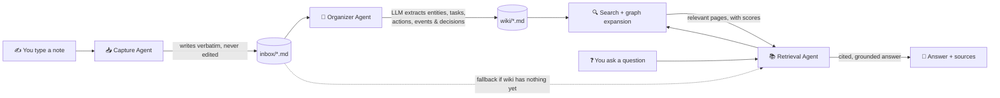

<div align="center">


<br>
<small><i>Remember Better.</i></small><br><br>

**A local-first, long-term memory for anything you'd otherwise forget.**

<font color='grey'><small>Made with ❤︎ by [Aaryan Verma](https://linkedin.com/in/aaryanverma)</small></font>

Talk to it like a notebook. It quietly turns your notes into a living, cross-linked wiki — and answers your questions with evidence.

`Markdown storage` · `No database` · `Any LLM`


[](https://opensource.org/licenses/MIT)
[](https://pepy.tech/projects/graybox)
[](https://deepwiki.com/Aaryanverma/graybox)

</div>

---

<details>
<summary><strong>📹 Video Demo</strong></summary>
<br>

<p align="center">
  <a href="https://www.youtube.com/watch?v=Xdj1GCQoFNs" target="_blank">
    
  </a>
</p>

</details>

---

## What is this?

You constantly generate information you'd like to hold onto — a decision made in a work meeting, a teammate's name and role, a task someone owes you, but just as easily a friend's birthday, a book someone recommended, notes from a doctor's visit, or an idea you had in the shower. Most of it evaporates. **Gray Box** is a small, local-first tool that:

1. **Captures** anything you type or paste, instantly and without judgment — work notes, personal journaling, project ideas, whatever.
2. **Organizes** it when you run `organize` — pulling out people, projects, tasks, actions, meetings, events, and decisions into their own Markdown pages, all cross-linked.
3. **Answers questions** about anything you've captured, citing exactly which note or page it got the answer from — and refusing to guess when it doesn't know.

It ships with page types that skew toward work (`project`, `meeting`, `decision`, `task`, `action`) since that's the original use case, but there's nothing work-specific in how it works — a `person` page doesn't care if it's a coworker or a friend, and a `topic`/`journal`/`event` page works just as well for a hobby or a personal reflection as it does for a work concept. Use one workspace for work and another for personal life (see [Workspaces](#workspaces)), or mix both in one — it's your call.

No vector database required. No cloud lock-in. No proprietary format. Just `.md` files on your disk that you (or any other tool) can read forever.

---
## Table of contents
 
- [Why it's built this way](#why-its-built-this-way)
- [How it works](#how-it-works)
- [Installation](#installation)
- [Quick start](#quick-start)
- [Interactive TUI](#interactive-tui)
- [Workspaces](#workspaces)
- [Command reference](#command-reference)
- [Configuration](#configuration)
- [What a wiki page looks like](#what-a-wiki-page-looks-like)
- [Page history](#page-history)
- [Design principles](#design-principles)
- [Migrate external vault](#migrate-external-vault)
- [Development](#development)
- [FAQ](#faq)
- [Roadmap](#roadmap)

---

## Why it's built this way

| Choice | Reasoning |
|---|---|
| 📁 **Plain Markdown + YAML frontmatter** | Readable forever, greppable, diffable, works with any editor or static site generator. No vendor lock-in. |
| 🚫 **No vector database by default** | For personal-scale (hundreds–low thousands of pages), keyword search is fast, transparent, and debuggable. Embeddings are an *optional* upgrade, not a prerequisite — and when enabled, scored on the same 0–1 scale as everything else, so one `min_score` threshold governs relevance everywhere. |
| 🔒 **Immutable inbox** | Your raw notes are never edited or deleted by the organizer. If the AI ever mis-extracts something, your original words are always still there to fall back on. |
| 🔌 **Pluggable LLM** | Powered by [LiteLLM](https://github.com/BerriAI/litellm) under the hood, so you can point it at OpenAI, Anthropic, Gemini, Mistral, Ollama, or any self-hosted model — just change one config value. |
| 🧩 **Small, single-purpose modules** | Capture, Organize, Search, and Retrieval don't know about each other's internals. Swap any one of them out without touching the rest. |
| 🕸️ **A real graph, not just a RAG index** | Retrieval follows `related`/`backlinks` from strong wiki matches, with one hop by default (`retrieval.graph_max_hops` is configurable). `sources` link pages back to their original captures. |

---

## How it works



**The agents, in plain terms:**

- **Capture** — does *almost nothing*, on purpose. It writes your text to `inbox/` untouched. No parsing, no AI, no delay. This step should never be the thing that loses your idea.
- **Organizer** — runs on demand (`organize`). It reads unprocessed inbox items and asks the LLM to extract structured facts as JSON — people, projects, tasks, actions, meetings, events, decisions, and the relationships between them — favoring high recall on anything the note is actually *about* while ignoring incidental words that merely appear in it (a vague note still yields at least a `topic` page rather than nothing). *Deterministic Python code* — not the LLM — then creates/merges the actual wiki pages and maintains backlinks, so writes stay predictable and auditable. Reconciling a note against an existing page (instead of creating a near-duplicate) only happens on a high-confidence name/date match; a loosely-related note gets its own page rather than being forced onto an unrelated one. After organization, touched pages with at least three notes have their summaries refreshed automatically unless `auto_refresh_summaries: false` is set.
- **Retrieval** — when you `ask` or `chat`, it searches wiki pages first (keyword + optional semantic), expands from strong wiki matches by hopping (configurable with `retrieval.graph_max_hops`) through `related`/`backlinks` so linked-but-not-lexically-matching pages still surface, then asks the LLM to answer **using only that context**, with inline citations like `[person/aaryan]`. It tries strong wiki evidence first. If that answer is empty or a recognized refusal, it continues to inbox evidence. It can also fall back to raw, un-organized inbox captures or to weaker wiki matches when no strong wiki match exists — but only ever with an explicit warning stitched into the answer telling you the evidence is unorganized or loosely related, never silently. If nothing relevant is found at all, it says so honestly instead of making something up.
- **Curate** — human-in-the-loop fixes (`merge`, `edit`, `delete`) for organizer mistakes: duplicate pages, wrong titles/types, hallucinated entities. Nothing here runs automatically; every action is an explicit command, and nothing here calls the LLM.

---

## Installation

Requires **Python 3.10 or newer**.

```bash
pip install graybox

# for tests
pip install 'graybox[test]'

# for azure auth (to enable microsoft entra id authentication)
pip install 'graybox[azure]'
```

```bash
git clone https://github.com/Aaryanverma/graybox
cd graybox
pip install -e .
```

Then point it at an LLM. Set your API key however your provider expects it — e.g. in an `.env` file (referenced by `env_file:` in `config.yaml`) or as an environment variable such as `GRAYBOX_LLM_API_KEY`. The app root defaults to `.graybox` inside the current terminal directory, not your home folder.

---

## Quick start

- Open a terminal/CMD

- Download this [Config File](graybox/config.example.yaml) into your working directory, update it with your workspace, LLM and other details.

- The fastest way to try Gray Box is to just run it with no arguments and let the interactive menu guide you (see [Interactive TUI](#interactive-tui) below), or script it directly with the CLI subcommands shown next.

```bash
# 1. Capture whatever's on your mind — no structure required
graybox capture "Talked to Aaryan about the Atlas migration; he owns the DB cutover, due next Friday"
 
# 2. Turn captures into structured, linked wiki pages
graybox organize
 
# 3. See what it built
graybox pages
 
# 4. Ask a question — get a cited answer
graybox ask "who owns the Atlas DB cutover and when is it due?"
 
# 5. Or hold a running conversation instead of one-off questions
graybox chat
```
 
Want to preview what `organize` *would* do before it writes anything?
 
```bash
graybox organize --dry-run
```
 
This still calls the LLM and reports proposed page references, but does not write wiki changes or mark captures as processed. Initial configuration loading may create workspace directories and metadata.

---

## Interactive TUI

Run `graybox` with no arguments to drop into a full-screen terminal UI (built on [Textual](https://github.com/Textualize/textual)) — arrow keys to move, Enter to select, and Escape to go back — where `capture`, `organize`, `ask`, `chat`, `status`, `dashboard`, `migrate-vault`, and workspace switching are all just a keystroke away. Search, pages, and duplicate browsing are available under **More Options**. It's the recommended way to get a feel for the whole loop (capture → organize → ask) without memorizing any commands.

<div align='center'>
</img>
</div>

If you'd rather script Gray Box or wire it into other tools, every action in the TUI is also a plain CLI subcommand — that's what the [Quick start](#quick-start) walkthrough above and the [Command reference](#command-reference) below cover.

---

## Workspaces

Everything above happens inside a **workspace** — a fully isolated inbox + wiki + processed/forgotten state. Out of the box you get one, `personal` (configurable via `default_workspace` in `config.yaml`), but you can create as many as you like — e.g. `personal` and `work` — to keep unrelated knowledge silos from bleeding into each other. A wiki page created in `work` is invisible to `ask`/`search`/`pages` while `personal` is active, and vice versa.

```bash
# See every workspace you've created, with the active one marked
graybox workspace-list

# Create a new, empty workspace and switch to it immediately
graybox workspace-create work --description "Day job knowledge base"

# Switch back and forth whenever you like — no data is touched or lost
graybox workspace-switch personal
graybox workspace-switch work

# Omit the name to get an interactive picker instead
graybox workspace-switch
```

A few things worth knowing:

- **Isolation is real, not cosmetic.** `capture`, `organize`, `ask`, `chat`, `search`, `pages`, `dupes`, and `dashboard` all operate on whichever workspace is currently active — set by `graybox workspace-switch <name>` (persisted in `config.yaml`'s `active_workspace` key) or overridden per-invocation with `--config` pointing at a different config file.
- **Cross-workspace search is opt-in.** `graybox ask "<question>" --all`, `graybox chat --all`, and `graybox search "<query>" --all` search across *every* workspace at once and tag each result/citation with which workspace it came from (e.g. `work/project/atlas-migration`), instead of just the active one. Graph expansion is skipped in this mode, since `related`/`backlinks` refs aren't workspace-qualified.
- **Each workspace can live anywhere on disk.** `workspace-create <name> --path <custom-path>` stores that workspace's data at a custom location (useful for e.g. keeping a `work` workspace inside a company-managed synced folder) while still registering it under the same `graybox workspace-switch` workflow. Omit `--path` and it lives under `<root>/workspaces/<name>/` by default.
- **The interactive TUI** (`graybox` with no arguments) has dedicated `switch-workspace` and `create-workspace` menu entries that mirror the CLI commands above, including the same optional custom path prompt.
- **Nothing is ever merged across workspaces silently.** If the same fact needs to exist in two workspaces, capture it in both — there's no automatic sync between them, by design.

---

## Command reference

| Command | What it does |
|---|---|
| `graybox capture "<text>"` | Saves a note to the immutable inbox. Omit the text to read from stdin; use `--file <path>` to import UTF-8 text with a source-path header. PDF, DOCX, and other binary document formats are not supported. |
| `graybox organize` | Processes all unprocessed inbox items into wiki pages. Add `--dry-run` to preview without writing. |
| `graybox ask "<question>"` | Searches the wiki (keyword + optional semantic + graph expansion), asks the LLM to answer using only what it finds, and prints the answer plus its sources. `--all` searches every workspace. |
| `graybox chat` | Multi-turn Q&A session — ask follow-ups without returning to the main menu each time. Conversation history is threaded into both search and the LLM prompt, so pronouns/ellipsis ("when's it due?", "why him?") resolve against the previous turn. Grounding rules still apply: history only resolves references, never supplies facts on its own. `--all` to search across every workspace. |
| `graybox search "<query>"` | Local keyword search, showing wiki matches first and raw inbox matches if no wiki matches are found. No LLM or embedding call. `--top-k N` controls results per corpus (default: 10); `--all` searches every workspace. |
| `graybox pages` | Lists all wiki pages. Filter with `--type project\|person\|meeting\|technology\|company\|topic\|task\|action\|decision\|event\|journal`. |
| `graybox status` | Quick summary: workspace path, inbox count, page count, active LLM model. |
| `graybox dashboard` | Generates a self-contained, read-only HTML dashboard (`<workspace>/exports/dashboard.html`) with a task kanban board, filters, and a force-directed graph of your wiki's cross-links. Never writes back to `inbox/` or `wiki/`. [See Example](assets/dashboard.png)|
| `graybox dupes` | Flags wiki pages that *look* like duplicates (fuzzy name match). Suggestion only — nothing is merged automatically. `--type` to restrict, `--threshold` (0–1, closer to 1 = more similar; default: `retrieval.dedup_threshold`, 0.85) to tune sensitivity. |
| `graybox merge <keep-ref> <drop-ref>` | Merges `<drop-ref>` into `<keep-ref>` — unions notes, sources, aliases, tags, and links, keeps `<keep-ref>`'s title/type/status/summary on conflicts, deletes the dropped page, and rewires every other page that linked to it. `--dry-run` to preview. |
| `graybox edit <ref>` | Fixes a wrongly-extracted page: `--title`, `--type`, `--status`, `--alias` (repeatable). Renaming or retyping moves the page and rewires every reference to it. `--dry-run` to preview. |
| `graybox delete <ref>` | Removes a hallucinated/wrongly-created page and strips dangling links to it from the rest of the wiki. Reports which inbox items it traced back to. `--dry-run` to preview. |
| `graybox forget <item-id>` | Tombstones a capture, excluding it from inbox search, inbox counts, and future organization. Existing wiki pages remain. `--purge` deletes the raw file; `--scrub` removes matching source-tagged notes and their source references from wiki pages. `--reason "..."` records why. |
| `graybox rebuild-index` | Rebuilds the embedding index for semantic search (requires `embeddings.enabled: true`). Backfills existing pages; `--type` restricts the rebuild to one page type. |
| `graybox refresh-summaries` | Re-synthesizes each page's summary from its accumulated notes, so long-lived pages don't go stale. `--type`, `--dry-run`, `--min-notes`, `--verbose` supported. |
| `graybox migrate-vault <vault-path>` | One-time import of an existing Obsidian Markdown vault. Classifies notes, creates or merges typed pages, preserves source provenance, and rewrites recognized links. Add `--dry-run` to preview without writing. Run `graybox rebuild-index` afterward when embeddings are enabled. |
| `graybox workspace-list` | Lists every workspace, marking which one is currently active. |
| `graybox workspace-switch [name]` | Switches the active workspace. Omit `name` for an interactive picker. |
| `graybox workspace-create [name]` | Creates a new, empty workspace and switches to it. `--description "..."` for a note; `--path <custom-path>` to store its data somewhere other than the default `<root>/workspaces/<name>/`. Omit `name` to be prompted interactively. |

Interactive text prompts support Unicode input, cursor movement, Home/End, Delete/Backspace, and bracketed paste. Escape cancels a prompt; `exit` or `quit` also ends a chat.

In the interactive TUI (running `graybox` with no arguments), the **capture** screen lets you press `F` to import a file by path instead of typing a note directly — equivalent to `graybox capture --file <path>`. Workspace creation also accepts an optional custom path so a workspace can live anywhere on disk, and that path is remembered for later switching. A **dupes** screen is also available there for read-only browsing; `merge`, `edit`, `delete`, and `forget` are CLI-only for now, since they take structured arguments that don't map cleanly onto the keystroke-driven TUI.

Every command accepts `--config <path>` to use a config file other than `./config.yaml`.

---

## Configuration

Configuration values come from defaults, then the selected YAML file, then environment overrides. If `env_file` is configured, it is resolved relative to that YAML file and loaded with `override=True`, so its values replace matching shell environment variables before overrides are applied.

Graybox searches for configuration in this order:

1. Explicit `--config <path>` (place it before the subcommand)
2. `GRAYBOX_CONFIG`
3. `config.yaml`
4. `.graybox/config.yaml`
5. `~/.graybox/config.yaml`

The first existing file wins; these files are not merged together. Paths in steps 3–4 are relative to the current terminal directory. The home-directory fallback is automatic. To select a file explicitly:

```bash
graybox --config /path/to/config.yaml status
```

Example using the core defaults (the downloadable example chooses Ollama and a stricter `min_score: 0.8`):

```yaml
root: ".graybox"          # app root inside the current terminal directory (set it before running graybox)
default_workspace: "personal"  # workspace created/used the very first time you run any command
env_file: "creds.env"          # optional .env file for API keys

llm:
  model_name: "gpt-5.6"        # built-in default; choose your provider's model/deployment
  temperature: 0
  base_url: ""
  max_tokens: 4096

auto_refresh_summaries: true  # after organize, refresh touched pages with at least 3 notes

prompts:
  answer_style: ""     # optional presentation preferences for ask/chat

retrieval:
  top_k: 5              # initial search results per corpus; graph expansion can add pages
  min_score: 0.4        # wiki relevance threshold on the normalized 0–1 scale
  dedup_threshold: 0.85 # name similarity threshold for organize/dupes
  semantic_min_score: 0.15 # raw cosine low anchor for semantic score calibration
  inbox_min_score: null    # ask/chat inbox threshold: min_score * 0.5 when unset
  graph_max_hops: 1
  graph_max_nodes: 15
  graph_max_neighbors_per_node: 5
  graph_decay: 0.65
  graph_min_score_ratio: 0.5 # graph score floor: min_score * this ratio

embeddings:
  enabled: false               # opt-in: turn on for semantic/paraphrase recall
  model_name: "text-embedding-3-small"
  base_url: ""
```

Keyword relevance, calibrated semantic relevance, and name similarity are all expressed on a **0–1 scale**, but they measure different things:

- **`min_score`** selects strong wiki matches in `ask`/`chat` and filters wiki results in `search`. The CLI's raw-inbox search uses half this value. `ask`/`chat` can also try weaker evidence with an explicit warning.
- **`inbox_min_score`** independently sets the stronger inbox fallback threshold for `ask`/`chat`; `null` derives it from `min_score * 0.5`.
- **`semantic_min_score`** is a raw cosine calibration anchor, not another normalized relevance threshold. Keep it below the high anchor of `0.5`.
- **`dedup_threshold`** controls name matching for organization and duplicate suggestions. An explicit `merge` command uses the references you provide and does not apply this threshold.

Set `prompts.answer_style` to preferences such as `"Use concise bullet points and answer in Hindi."` It controls presentation; the retrieval prompt still requires evidence, citations, and uncertainty handling. `GRAYBOX_ANSWER_STYLE_PROMPT` overrides the YAML value.

### Microsoft Entra ID Authentication

For using models hosted on Azure/Microsoft Foundry using Microsoft Entra ID authentication:

```yaml
llm:
  model_name: azure/<deployment-name>
  base_url: https://<resource-name>.openai.azure.com/
  api_version: "2025-01-01-preview"
  temperature: 0.0
  auth: azure #  <-- to be added (aliases: azure/entra/ms_entra/microsoft_entra)
```
> [!Note]
> - Model quality matters. Gray Box relies on the LLM for knowledge organization and retrieval.
> - For the best experience, use a reasonably capable model. Smaller or weaker models may still work, but can produce lower-quality organization, miss relationships or entities, and reduce the quality of answers later.
> - You don't necessarily need the largest or most expensive model. A good general-purpose model with reliable structured-output/JSON support is recommended.

**Key environment variable overrides:**

| Variable | Overrides |
|---|---|
| `GRAYBOX_CONFIG` | Config-file discovery path |
| `GRAYBOX_ROOT` / `GRAYBOX_WORKSPACE` | `root` (the app root directory that contains `workspaces/`; `GRAYBOX_WORKSPACE` is a legacy alias for the same setting — it does **not** select which workspace is active) |
| `GRAYBOX_ACTIVE_WORKSPACE` | `active_workspace` (which workspace is active — same effect as `graybox workspace-switch <name>`) |
| `GRAYBOX_DEFAULT_WORKSPACE` | `default_workspace` (which workspace is created/used on first run) |
| `GRAYBOX_LLM_MODEL` | `llm.model_name` |
| `GRAYBOX_LLM_BASE_URL` | `llm.base_url` |
| `GRAYBOX_LLM_API_KEY` | `llm.api_key` |
| `GRAYBOX_TEMPERATURE` | `llm.temperature` |
| `GRAYBOX_ANSWER_STYLE_PROMPT` | `prompts.answer_style` |
| `GRAYBOX_TOP_K` | `retrieval.top_k` |
| `GRAYBOX_MIN_SCORE` | `retrieval.min_score` |
| `GRAYBOX_DEDUP_THRESHOLD` | `retrieval.dedup_threshold` |
| `GRAYBOX_SEMANTIC_MIN_SCORE` | `retrieval.semantic_min_score` |
| `GRAYBOX_INBOX_MIN_SCORE` | `retrieval.inbox_min_score` |
| `GRAYBOX_EMBEDDINGS_MODEL` | `embeddings.model_name` |
| `GRAYBOX_EMBEDDINGS_BASE_URL` | `embeddings.base_url` |
| `GRAYBOX_EMBEDDINGS_API_KEY` | `embeddings.api_key` (plural `EMBEDDINGS`) |
| `GRAYBOX_EMBEDDINGS_INPUT_TYPE` | `embeddings.input_type` |

Model names and provider-specific options are passed to LiteLLM; choose an identifier supported by your configured provider. Use the YAML boolean `embeddings.enabled: true` or `false` to control semantic search. The current loader also accepts `GRAYBOX_EMBEDDINGS_ENABLED`, but does not parse it as a boolean, so the string `false` would still enable embeddings.

---

## What a wiki page looks like

Every page is plain Markdown with YAML frontmatter — open it in any text editor, no special tooling required:

```markdown
---
id: aaryan-verma
type: person
title: Aaryan Verma
created: 2026-07-25T07:10:00Z
updated: 2026-07-25T07:10:00Z
aliases: []
related: [project/atlas-migration]
backlinks: [task/db-cutover]
sources: [20260725-071000-9f3a]
tags: []
status: ""
---

# Aaryan Verma

## Summary
Data scientist by profession.

## Notes
- (2026-07-25T07:10:00Z) Data scientist by profession. _(source: inbox/20260725-071000-9f3a)_

## Related
- [[project/atlas-migration]]

## Backlinks
- [[task/db-cutover]]

## Sources
- inbox/20260725-071000-9f3a
```

Organizer-created notes carry source tags linking them to inbox captures. Page references use singular types (`person/aaryan-verma`), while files use the directories in `TYPE_DIR` (`wiki/people/aaryan-verma.md`). Supported types are `project`, `person`, `meeting`, `technology`, `company`, `topic`, `task`, `decision`, `action`, `event`, and `journal`.

Frontmatter can also contain `attendees`, `date`, `owner`, `due`, `summary_refreshed_at`, and an `extra` metadata dictionary. Python callers can pass `extra` to `capture()`; the organizer carries it into extracted pages.

---

## Page history

Wiki writes through Gray Box record Markdown snapshots in `<workspace>/.state/history/<shard>/<type>--<slug>.jsonl`, without Git. Page deletion records a tombstone. History recording is best-effort; a history failure does not block the page write.

`HistoryTracker.history()` and `diff()` expose past versions through Python. `restore()` and `undo()` return snapshot text; they do not write it back to the wiki. There are currently no history or undo CLI commands.

`forget --scrub` removes matching extracted notes and source references from current pages, but does not regenerate summaries, clear embeddings, or erase history snapshots. `--purge` deletes only the raw inbox file. These commands are capture retraction tools, not complete erasure of every derived copy.

---

## Design principles

- **Capture must never fail or lose data.** It's the one part of the system that has zero tolerance for cleverness.
- **The LLM only reasons — it never touches the filesystem directly.** All page creation, slugging, merging, and backlink maintenance is deterministic Python, so behavior is auditable and doesn't drift between runs.
- **Answers are grounded or honest, never invented.** If the retrieval agent can't find supporting context, it says so plainly instead of guessing — the assistant would rather be unhelpful than wrong. This holds in `chat` mode too: conversation history may resolve *what* you're asking about, but it never supplies facts on its own.
- **Filesystem-first, embeddings second.** Vector search is a valid upgrade for paraphrase-y questions ("who's the data person on this project?" when your notes only say "data scientist"), but it's opt-in, and scored on the exact same scale as everything else rather than introducing a second threshold to learn.

---

## Migrate external vault

Migration of external vault directly into Gray Box is currently supported for Obsidian only.

- **Obsidian vault migration** — import an existing vault of Markdown notes into the current Gray Box workspace. Notes are classified into typed pages, existing pages can be matched and merged, and the original source remains traceable through the inbox.
- **A safe migration preview** — use `--dry-run` to see which pages would be created or merged without writing files. Migration is intentionally one-time, not a synchronization feature; keep a backup and avoid re-running it against a vault that has already been imported and edited.

Either run through TUI

or through following CLI commands:

```bash
# Preview the import
graybox migrate-vault /path/to/your/obsidian-vault --dry-run

# Run the import
graybox migrate-vault /path/to/your/obsidian-vault
```

The command recursively reads `.md` notes, skips Obsidian's `.obsidian/` bookkeeping directory, and reports created, merged, skipped, and failed notes. If embeddings are enabled, run `graybox rebuild-index` after the import.

---

## Development

From the repository root:

```bash
pip install -e '.[test]'
python -m pytest tests
```

Runtime dependencies come from `requirements.txt`; package metadata and optional test/Azure dependencies are in `pyproject.toml`. [`llms.txt`](llms.txt) provides a source map for coding assistants.

---

## FAQ

<details>
<summary><strong>How is this different from a notes app, a wiki tool, or a general RAG chatbot?</strong></summary>
<br>

A few things distinguish the *shape* of this project, without claiming it's the right shape for everyone:

- **You don't structure anything yourself.** Most note/wiki tools assume you'll deliberately create pages, tag them, and link them. Here, you just capture loose, messy text the way it occurs to you, an LLM extracts entities when you run `organize`, and Python code writes the pages and links. If you already enjoy hand-structuring your notes, a dedicated editor like Obsidian may suit you better — and since Gray Box is just Markdown + YAML frontmatter on disk, you can even point such an editor at a Gray Box workspace to browse it.
- **It's a graph of typed facts, not a pile of searchable documents.** A page is a `person`, `project`, `task`, `decision`, etc. — with real `related`/`backlinks` relationships between them — rather than an opaque text chunk ranked by similarity. Retrieval can walk those relationships (one hop by default, with a configurable depth and limits on nodes and neighbors), which is a different retrieval model from typical chunk-and-embed RAG setups.
- **Keyword + graph search is the default; embeddings are optional.** Here, plain keyword search plus the link graph handles most questions with zero extra API calls or infrastructure; semantic search is available if you want paraphrase-level recall, but it's a deliberate opt-in, not a required dependency (see below for what that actually involves).
- **Everything is inspectable, forever.** Every page is a `.md` file with YAML frontmatter, every fact traces back to a specific captured note via a `sources:` field, and nothing is stored in a format that requires this tool specifically to read it back. If you stop using Gray Box tomorrow, your knowledge base is just a folder of Markdown files.

None of this makes it a replacement for tools built for different goals — real-time collaboration, rich WYSIWYG editing, or team-wide wikis aren't what this is for. It's aimed squarely at one person's running memory of their own life and work, captured with as little friction as possible.

</details>

<details>
<summary><strong>Do I need a vector database to use this?</strong></summary>
<br>

No. Keyword search (`search_engine.py`'s `coverage_scorer`) plus the wiki's own link graph is the default and the thing this project is built around. Embeddings are entirely opt-in via `embeddings.enabled: true` in `config.yaml`, and the whole system — capture, organize, curate, dashboard — works with them off.

</details>

<details>
<summary><strong>I turned on <code>embeddings.enabled: true</code> — where's the vector store?</strong></summary>
<br>

There isn't one, on purpose, and it's worth understanding what that actually means before you flip the switch:

- Embeddings are stored as **plain JSON** in `<workspace>/.state/embeddings.json` — one entry per page, each holding the raw float vector LiteLLM returned plus a content hash (so re-indexing is skipped for unchanged pages).
- Search is a **linear scan**: every `ask`/`chat` computes cosine similarity between your question's embedding and *every* stored page vector, in Python, with no index (no HNSW, no IVF, nothing FAISS/Chroma/pgvector-shaped). See `EmbeddingIndex.search()` in `embedding_index.py`.
- **Scaling**: the JSON file is loaded into memory and similarity is computed for each stored vector. Time and memory grow with page count and vector size; there is no approximate nearest-neighbor index.
- **API calls**: organization indexes new or changed pages when embeddings are enabled, and each `ask`/`chat` question attempts one query embedding call. Answer synthesis, follow-up query rewriting, fallback attempts, and context/history compression can add completion calls. Summary refreshes can also add calls during organization.
- Turning embeddings off removes embedding calls. Keyword search and graph traversal remain local; answer generation still uses the configured LLM.

</details>

<details>
<summary><strong>Does this call an LLM every time I capture a note?</strong></summary>
<br>

No. `capture` never touches the LLM — it's pure disk I/O (`capture.py` → `write_inbox_item`). LLM work happens during `organize` (extraction and optional automatic summary refresh), `ask`/`chat` (answers, follow-up rewriting, and compression when needed), `refresh-summaries`, and `migrate-vault` (classification). `rebuild-index` calls the embedding provider. Dry-run organization, migration, and summary refresh can still call the LLM. This is deliberate: the one step that must never fail or lose your idea (capture) has zero dependency on a network call or an LLM being configured correctly.

</details>

<details>
<summary><strong>What happens if the LLM extracts something wrong — a hallucinated person, a wrong task owner, a duplicate page?</strong></summary>
<br>

Nothing is auto-corrected, but nothing is destroyed either:

- Your original note is untouched in `inbox/` regardless of what the organizer did with it — `capture`'s immutability guarantee holds even when `organize` gets confused.
- `graybox dupes` flags likely duplicate pages (fuzzy name matching); `graybox merge` fixes them, unioning notes/sources/links and rewiring every reference automatically.
- `graybox edit` fixes a wrong title/type/status/alias, and rewires references if the page's ref changes as a result.
- `graybox delete` removes a fully hallucinated page and reports exactly which inbox item(s) it traced back to, so you can see what caused the bad extraction.
- `graybox forget <item-id> --scrub` retroactively strips a bad capture's notes back out of whatever pages they landed in, if you decide the source note itself shouldn't have been organized at all.

All of `curate.py` is deterministic Python with no LLM involvement, precisely so that fixing an organizer mistake doesn't risk introducing a *new* one.

</details>

<details>
<summary><strong>Can it lie to me / make up an answer?</strong></summary>
<br>

`ask`/`chat` are built to refuse rather than guess. The retrieval prompt (`RETRIEVAL_SYSTEM`/`CHAT_RETRIEVAL_PROMPT_TMPL`) explicitly instructs the model to answer only from the retrieved context and say so plainly if the context doesn't contain the answer — and when search returns no candidate evidence, it returns `NO_EVIDENCE_MSG` without an answer-generation call. Chat query rewriting or an enabled embedding lookup may already have called the provider. This is an instruction to the model, not a guarantee — no LLM-backed system can promise zero hallucination — but the design actively works against it rather than leaving it to chance, and the model is instructed to provide inline citations that you can verify against the source notes.

</details>

<details>
<summary><strong>Is my data private? Does anything leave my machine?</strong></summary>
<br>

Your inbox, wiki, and state are stored locally. LLM and embedding operations send note content, retrieved context, or chat history to the provider configured through LiteLLM. Use local endpoints for both completion and embeddings (or disable embeddings) to keep those model requests on your machine.

</details>

<details>
<summary><strong>Can multiple people use the same workspace?</strong></summary>
<br>

Not concurrently, no — there's no locking, merge conflict resolution, or multi-writer story. Each workspace is designed for one person's (or one local process's) knowledge base at a time. Multiple *workspaces* on one machine, or synced via your own tooling (e.g. a synced folder), are fine since each is fully isolated; simultaneous writers to the *same* workspace directory are not supported.

</details>

<details>
<summary><strong>Why Markdown files instead of SQLite/a real database?</strong></summary>
<br>

Longevity and inspectability. A `.md` file with YAML frontmatter opens in literally anything, forever, with zero tooling — you can `grep` your entire knowledge base, diff a page's history in any text-based diff tool, or migrate away from Gray Box entirely just by keeping the files. A database is faster at scale, but this project is explicitly optimizing for personal scale (hundreds–low thousands of pages) where that speed advantage doesn't matter and the durability/transparency advantage does.

</details>

---

## Roadmap

- [ ] Quick Capture (To be implemented as a separate library)
- [ ] Decision Intelligence & Memory Timeline
- [ ] Meeting summarization
- [ ] Automatic daily journal digest
- [ ] Typed relationship edges (causal/dependency traversal — "what's blocking X," "why was Y decided" — beyond simple co-occurrence links)

---

<div align="center">

*Built to be the smallest, cleanest thing that could plausibly work — not the most feature-complete.*

</div>
